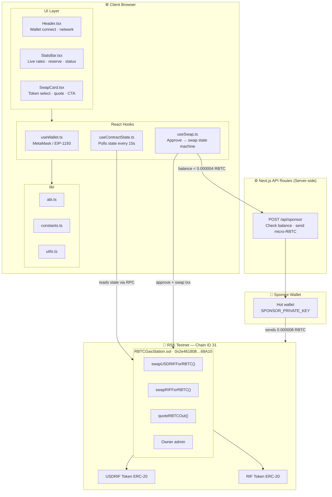
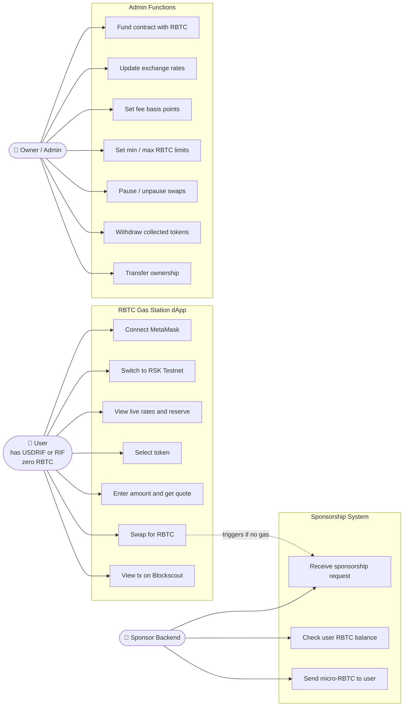
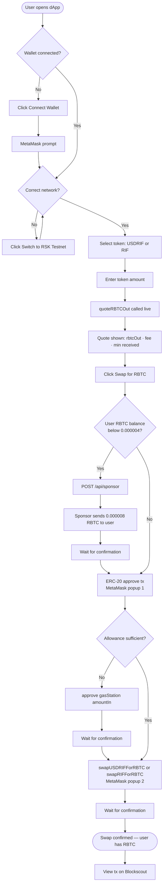
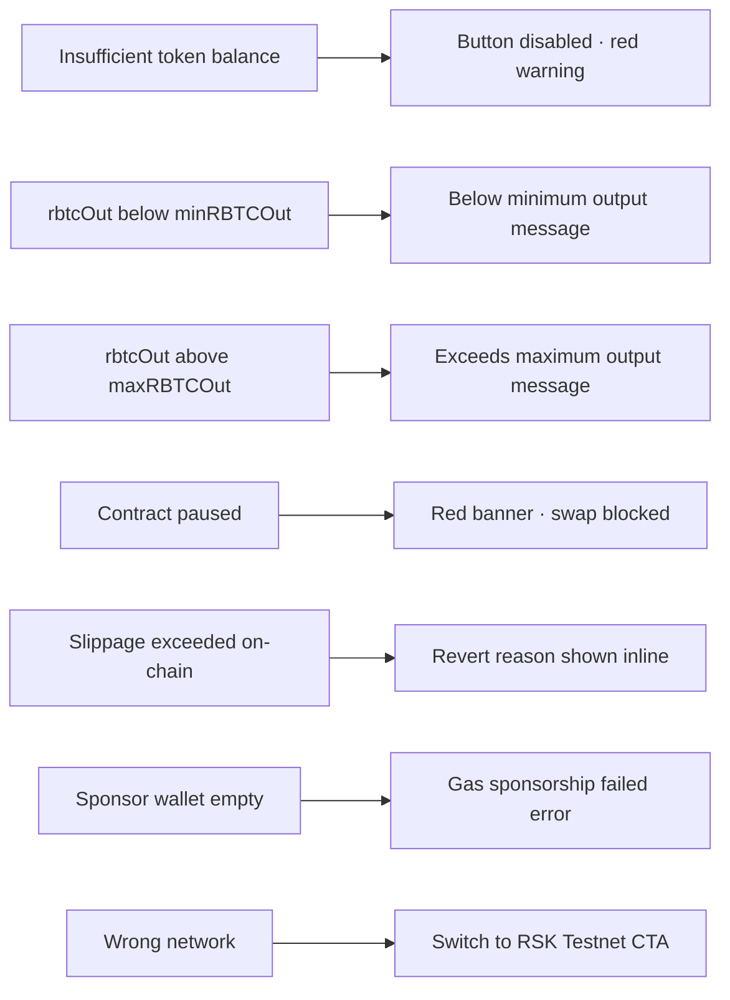
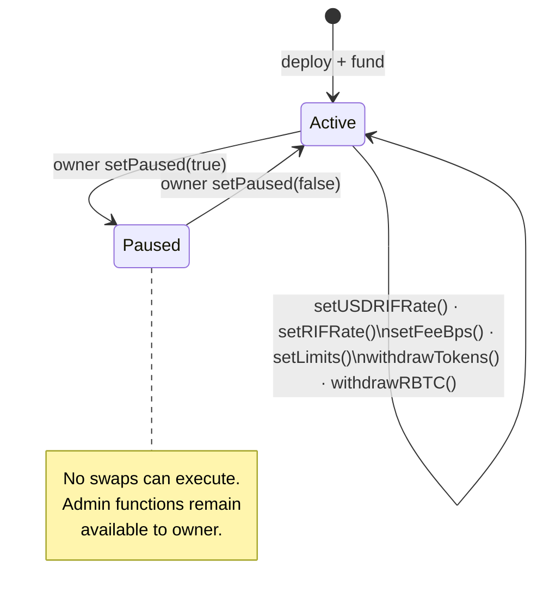
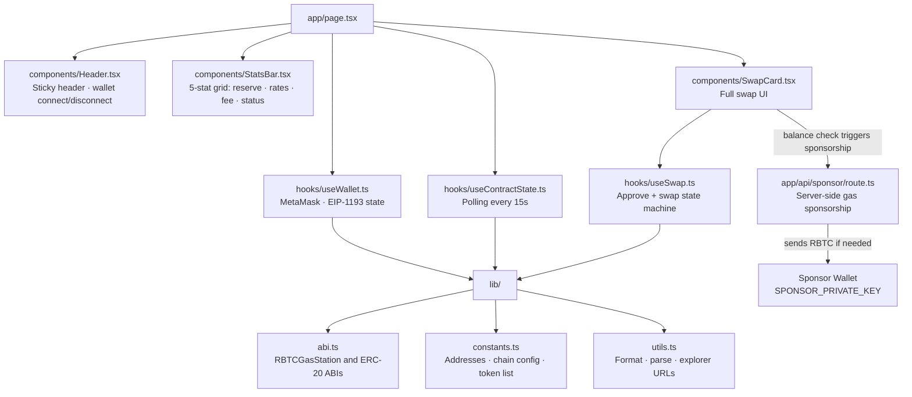
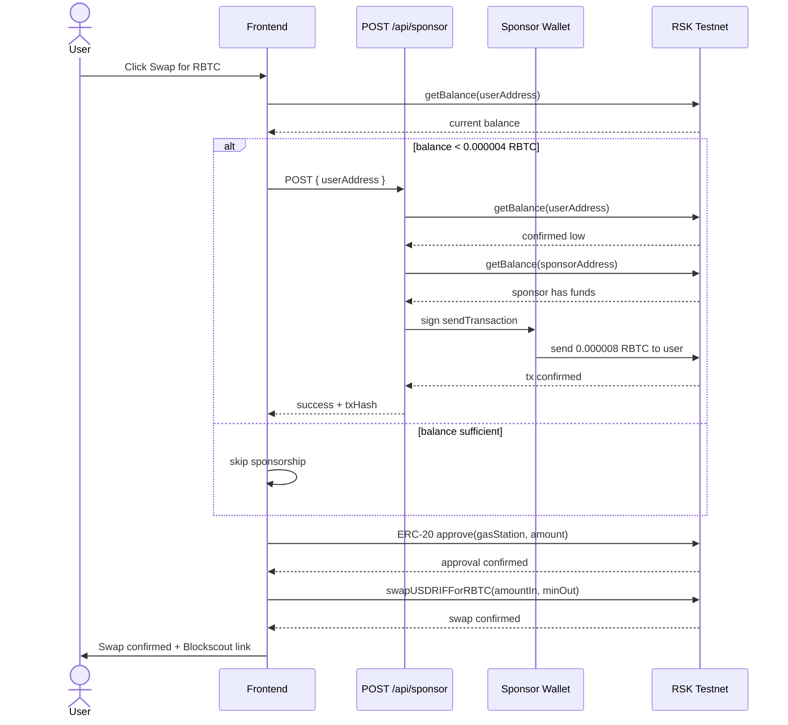
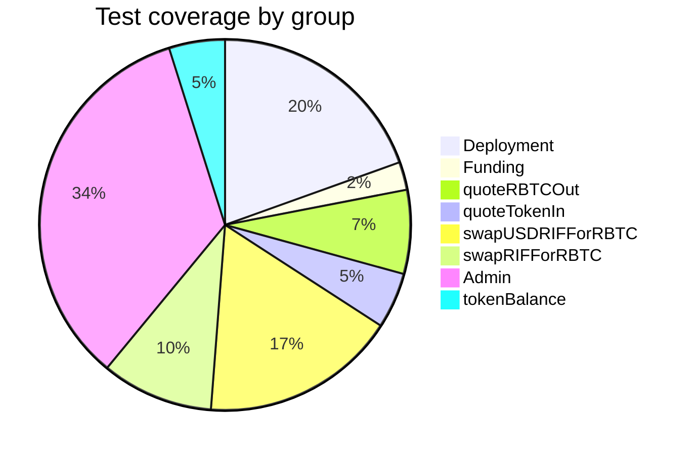

# ⛽ RBTC Gas Station

> **A pre-funded RBTC Gas Station on Rootstock Testnet.** Users with zero RBTC can swap USDRIF or RIF tokens to receive RBTC gas instantly — no bridges, no CEX, no waiting.

[](LICENSE)
[](https://rootstock-testnet.blockscout.com)
[](https://rootstock-testnet.blockscout.com/address/0x2e461808D953B75ec14E92aeF421CfE19Aa68A10)
[](https://nextjs.org)
[](https://hardhat.org)

---

## 📋 Table of Contents

- [Overview](#overview)
- [Live Deployment](#live-deployment)
- [Architecture](#architecture)
- [Use Case Diagram](#use-case-diagram)
- [User Flow](#user-flow)
- [Smart Contract](#smart-contract)
- [Frontend](#frontend)
- [Gas Sponsorship System](#gas-sponsorship-system)
- [Environment Variables](#environment-variables)
- [Local Development](#local-development)
- [Deployment](#deployment)
- [Testing](#testing)
- [Security](#security)
- [Mainnet Readiness](#mainnet-readiness)

---

## Overview

The **RBTC Gas Station** solves the cold-start problem on Rootstock: new users arriving with USDRIF or RIF tokens but zero RBTC have no way to pay gas for their first transaction. This dApp breaks that deadlock by:

1. **Swapping** USDRIF or RIF tokens directly for RBTC at an owner-set rate
2. **Sponsoring** gas for the swap itself — if the user has zero RBTC, a backend wallet sends them a tiny amount first
3. **Protecting** the reserve with configurable min/max output limits and a fee

The entire cycle — approve token → swap → receive RBTC — happens in two browser transactions, with the first gas cost covered automatically.

---

## Live Deployment

| Resource | Link |
|---|---|
| 🌐 Contract Address | [`0x2e461808D953B75ec14E92aeF421CfE19Aa68A10`](https://rootstock-testnet.blockscout.com/address/0x2e461808D953B75ec14E92aeF421CfE19Aa68A10) |
| ✅ Verified & Tested | [View on RSK Explorer (Blockscout)](https://rootstock-testnet.blockscout.com/address/0x2e461808D953B75ec14E92aeF421CfE19Aa68A10?tab=contract) |
| 🔗 Network | RSK Testnet (Chain ID: 31) |
| 🔍 Block Explorer | [rootstock-testnet.blockscout.com](https://rootstock-testnet.blockscout.com) |

---

## Architecture



---

## Use Case Diagram



---

## User Flow

### Happy Path — Zero-Gas User



### Error Paths



---

## Smart Contract

### `RBTCGasStation.sol`

Deployed and verified at [`0x2e461808D953B75ec14E92aeF421CfE19Aa68A10`](https://rootstock-testnet.blockscout.com/address/0x2e461808D953B75ec14E92aeF421CfE19Aa68A10?tab=contract) on RSK Testnet.

#### Contract State Machine



#### Fee Formula

```
gross_rbtc = token_amount_in × 1e18 / rate_token_per_rbtc
fee_rbtc   = gross_rbtc × feeBps / 10000
rbtc_out   = gross_rbtc - fee_rbtc
```

#### Key Parameters (at deployment)

| Parameter | Value |
|---|---|
| USDRIF rate | 3000 USDRIF per RBTC |
| RIF rate | 1500 RIF per RBTC |
| Fee | 0.5% (50 bps) |
| Min RBTC out | 0.00001 RBTC |
| Max RBTC out | 0.0001 RBTC |
| Seed funding | 0.0001 RBTC |

#### Owner Admin Functions

| Function | Description |
|---|---|
| `setUSDRIFRate(newRate)` | Update USDRIF/RBTC exchange rate |
| `setRIFRate(newRate)` | Update RIF/RBTC exchange rate |
| `setFeeBps(bps)` | Update protocol fee (max 9999 bps) |
| `setLimits(min, max)` | Set min/max RBTC output per swap |
| `setPaused(bool)` | Emergency pause/unpause |
| `withdrawTokens(token, amount)` | Collect accumulated tokens |
| `withdrawRBTC(amount)` | Withdraw RBTC reserve |
| `transferOwnership(address)` | Transfer contract ownership |

#### Events

```solidity
Swapped(user, tokenIn, tokenAmountIn, rbtcAmountOut, feeRBTC)
RateUpdated(token, newRate)
Funded(funder, amount)
Withdrawn(token, amount)
PausedSet(paused)
OwnershipTransferred(oldOwner, newOwner)
```

---

## Frontend

Built with **Next.js 16**, **ethers.js v6**, and **Tailwind CSS v4**.

### Component Tree



---

## Gas Sponsorship System



> `SPONSOR_PRIVATE_KEY` is **server-side only**. It is never prefixed `NEXT_PUBLIC_` and is never accessible from the browser.

---

## Environment Variables

### Hardhat / Deploy (root `.env`)

```dotenv
RSK_TESTNET_RPC_URL=https://public-node.testnet.rsk.co
WALLET_PRIVATE_KEY=your_deployer_private_key
```

### Frontend (`Frontend/rskfuelfrontend/.env.local`)

```dotenv
# Token addresses on RSK Testnet
NEXT_PUBLIC_USDRIF_ADDRESS=0x...
NEXT_PUBLIC_RIF_ADDRESS=0x...

# Deployed GasStation contract
NEXT_PUBLIC_GAS_STATION_ADDRESS=0x2e461808D953B75ec14E92aeF421CfE19Aa68A10

# Server-only: sponsor wallet private key — NEVER expose client-side
SPONSOR_PRIVATE_KEY=your_sponsor_wallet_private_key
```

---

## Local Development

### Prerequisites

- Node.js `lts/hydrogen` (see `.nvmrc`) — run `nvm use`
- MetaMask configured for RSK Testnet

### 1. Clone & install

```bash
git clone https://github.com/your-org/rbtc-gas-station.git
cd rbtc-gas-station

# Root (Hardhat)
npm install

# Frontend
cd Frontend/rskfuelfrontend && npm install
```

### 2. Configure environment

```bash
# Root
cp .env.example .env
# Fill RSK_TESTNET_RPC_URL and WALLET_PRIVATE_KEY

# Frontend
cd Frontend/rskfuelfrontend
cp .env.example .env.local
# Fill the four variables listed above
```

### 3. Compile contracts

```bash
npm hardhat compile
```

### 4. Run tests

```bash
npm hardhat test
# or with coverage report
npm hardhat coverage
```

### 5. Run the frontend

```bash
cd Frontend/rskfuelfrontend
npm run dev
# → http://localhost:3000
```

---

## Deployment

### Deploy contract to RSK Testnet

```bash
npx hardhat deploy --network rskTestnet
```

The deploy script (`deploy/deploy.ts`) will deploy `RBTCGasStation` and seed it with `0.0001 RBTC`. After deploying, update `NEXT_PUBLIC_GAS_STATION_ADDRESS` in your frontend `.env.local`.

### Deploy mock tokens (testnet only)

```bash
npx ts-node deploy/mintTokens.ts
```

### Verify contract

```bash
npx hardhat verify --network rskTestnet \
  0x2e461808D953B75ec14E92aeF421CfE19Aa68A10 \
  <USDRIF_ADDR> <RIF_ADDR> \
  <USDRIF_PER_RBTC> <RIF_PER_RBTC> \
  <FEE_BPS> <MIN_RBTC_OUT> <MAX_RBTC_OUT>
```

### Deploy frontend to Vercel

```bash
cd Frontend/rskfuelfrontend && vercel deploy
```

Set all four environment variables in your Vercel project settings. `SPONSOR_PRIVATE_KEY` must be server-side only — never a public variable.

---

## Testing

The test suite (`test/RBTCGasStation.test.ts`) covers **41 test cases** across 8 groups:



```bash
npm hardhat test
```

---

## Security

Please review [`SECURITY.md`](SECURITY.md) for the full responsible disclosure policy.

Report vulnerabilities to [security@rootstocklabs.com](mailto:security@rootstocklabs.com) or via the [GitHub Security Advisory](https://github.com/rsksmart/rootstock-hardhat-starterkit/security/advisories/new).

Key security properties: `onlyOwner` on all admin functions, emergency `pause`, min/max output guards, per-swap slippage parameter, no external oracle dependency, no `delegatecall`, no upgradeable proxy, EVM version pinned to `london` for RSK compatibility.

---

## 🚀 Mainnet Readiness

> **The following steps are required before deploying to RSK Mainnet.**

```mermaid
flowchart LR
    T1["Deploy to RSK Mainnet"]
    T2["Fund GasStation\nwith RBTC reserve"]
    T3["Fund Sponsor Wallet\nwith RBTC"]
    T4["Set up balance\nmonitoring and alerts"]
    T5["Configure oracle\nor rate automation"]
    T6["Calibrate rates\nand limits for mainnet"]
    T7["Update frontend env\nto mainnet address"]
    T8["Transfer to\nmulti-sig ownership"]
    T9(["Ready for Mainnet"])

    T1 --> T2 --> T3 --> T4 --> T5 --> T6 --> T7 --> T8 --> T9
```



### 1. Fund the Gas Station Contract

The contract must be pre-funded with real RBTC to serve swaps:

```
reserve = expected_daily_swaps × avg_rbtc_per_swap × buffer_days
```

Send RBTC directly to the contract address — the `receive()` fallback accepts it and emits a `Funded` event for accounting.

### 2. Fund the Sponsor Wallet ⚠️

The gas sponsorship system requires a hot wallet (`SPONSOR_PRIVATE_KEY`) with a live RBTC balance. Each sponsorship costs `0.000008 RBTC` (covers 2 txs: approve + swap).

```
minimum_balance = expected_new_users_per_day × 0.000008 RBTC × buffer_days
```

> **Example**: 100 new zero-gas users/day with a 7-day buffer → `0.0056 RBTC` minimum. Without a funded sponsor wallet, users with zero RBTC cannot complete their first swap.

Set up an automated alert when the sponsor wallet drops below your threshold.

### 3. Oracle Integration

Exchange rates are currently set manually by the owner. For mainnet, integrate a Chainlink or RIF-native price feed and automate rate updates to track real market prices.

### 4. Rate & Limit Calibration

| Parameter | Testnet | Mainnet Recommendation |
|---|---|---|
| `usdrifPerRBTC` | 3000 USDRIF | Real market rate |
| `rifPerRBTC` | 1500 RIF | Real market rate |
| `feeBps` | 50 (0.5%) | Review vs operating costs |
| `minRBTCOut` | 0.00001 RBTC | Enough to cover 2–3 txs |
| `maxRBTCOut` | 0.0001 RBTC | Cap to limit reserve drain per swap |

### 5. Mainnet Checklist

- [ ] Contract deployed and verified on RSK Mainnet
- [ ] GasStation contract funded with adequate RBTC reserve
- [ ] Sponsor wallet created and funded
- [ ] Sponsor wallet balance monitoring / alerts configured
- [ ] Rate update schedule or oracle automation in place
- [ ] Frontend `NEXT_PUBLIC_GAS_STATION_ADDRESS` updated to mainnet address
- [ ] `SPONSOR_PRIVATE_KEY` stored in production secret manager (not `.env` file)
- [ ] Emergency pause mechanism tested end-to-end
- [ ] Ownership transferred to multi-sig for mainnet

---

## Contributing

Pull requests welcome. For major changes, open an issue first. Before submitting run:

```bash
npm run format:write
npm run sol:format:write
npm run test
```

---

## License

MIT © RootstockLabs — see [LICENSE](LICENSE) for details.
